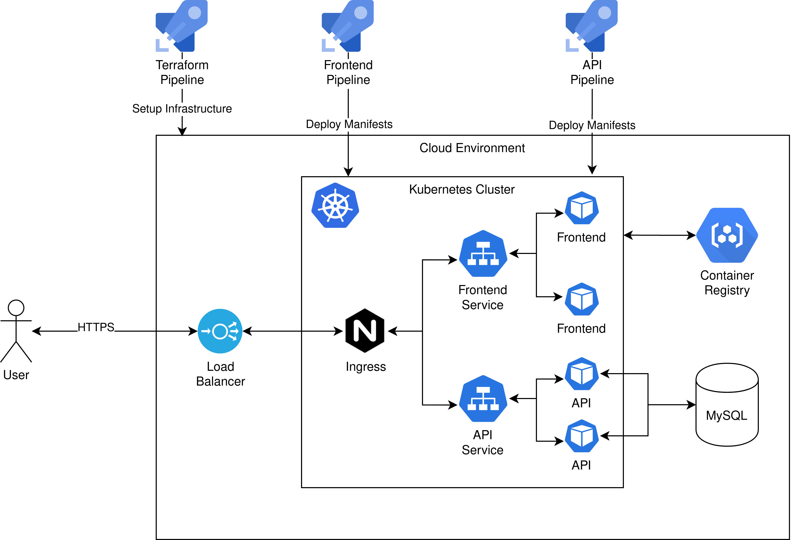

# Example system

**I made this setup to learn how to use Terraform to set up a k8s cluster in DigitalOcean. 
This repository contains the result of that setup.**

## Prerequisites

To run this program you need 2 programs, Make and Docker.
Make is necessary to utilize the Makefile and use commands such as `make start` etc., docker is used to run the actual program.

## Getting started

1. Clone the git repository
1. Run `make start`
1. Visit [http://localhost](http://localhost)

## Makefile commands

Use `make help` to see a list of commands for you to use.

## Tools

There are a few tools available to make development easier.

### PhpMyAdmin

PhpMyAdmin is running over at [localhost:8080](http://localhost:8080).
You can login using username `root` and password `root`.

### Kubernetes Dashboard

The DigitalOcean kubernetes cluster has the Kubernetes Dashboard available.

## Deployment

The deployment of this system is almost completely automated using Terraform
and Azure Pipelines.

### Infrastructure

The main pipeline that sets up infrastructure in DigitalOcean is the `setup-infrastructure.yaml`
pipeline that uses the files in `/terraform`.
The following resources are setup:

- DigitalOcean Project
- DigitalOcean Kubernetes Cluster
- DigitalOcean domain (and DNS records)
- DigitalOcean MySQL database cluster (with firewall, user and database)
- DigitalOcean Container Registry
- DigitalOcean LoadBalancer
- Valid ACME Letsencrypt certificate

Once the kubernetes cluster is running, the following K8s resources are created:

- Kubernetes namespace
- Kubernetes ingress (configuration found in `/terraform/main.tf`)
- Kubernetes secret containing the ACME certificate and key
- Kubernetes role, binding and service account called `deploy_user`
- Kubernetes secret, for the image pull secret
- Applies https://raw.githubusercontent.com/kubernetes/ingress-nginx/master/deploy/static/provider/cloud/deploy.yaml

These resources are automatically connected, allowing your cluster to be accessed
from the outside.

### Frontend

The frontend consists of a simple nginx container with a VueJS application at its
webroot.
The frontend pipeline builds the container, pushes this image to the container registry
and then applies the manifests to deploy a new version.

### API

The api consists of a .NET Core container that connects to a MySQL database.
The API pipeline builds the container, pushes this image to the container registry
and then applies the manifests to deploy a new version.
